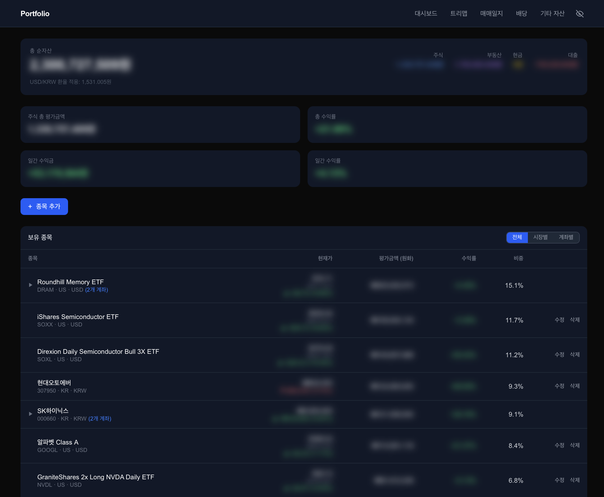
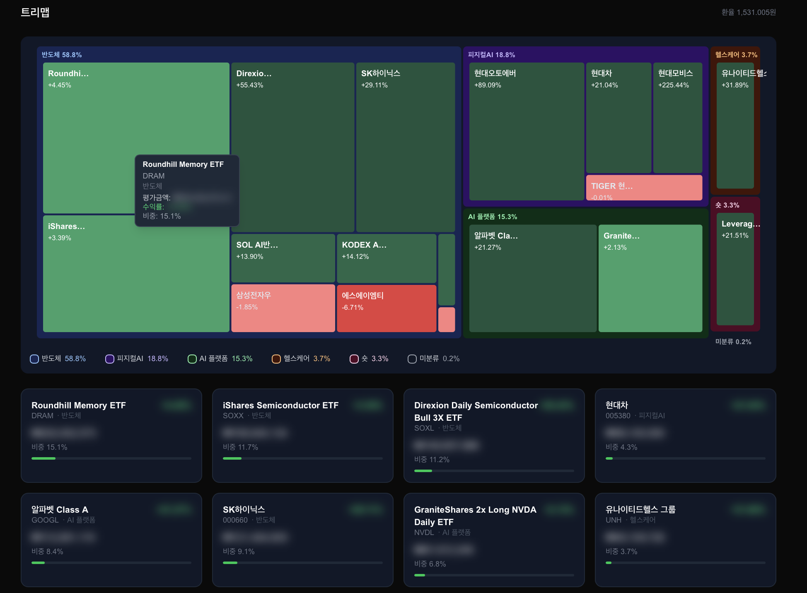

# Portfolio Dashboard

개인 주식 포트폴리오를 관리하는 셀프 호스팅 웹 앱입니다.  
한국투자증권 Open API로 국내·해외 주식 현재가를 실시간 조회하고, 매매 내역·배당·기타 자산까지 한 곳에서 관리합니다.

## 스크린샷

### 대시보드


### 트리맵


## 주요 기능

| 페이지 | 설명 |
|--------|------|
| **대시보드** | 주식 총 평가금액·수익률·일간 손익, 계좌별 그룹 토글, 종목별 현재가 테이블 |
| **트리맵** | 섹터 그룹별 2단계 트리맵 (비중 · 수익률 색상), 카드형 뷰 병행 |
| **매매일지** | 매수/매도 기록, 기간 토글(전체·이번주·이번달·이번분기·올해), 실현손익 합산(KRW+USD→원화 환산), 승률, FIFO 손익 계산 |
| **배당** | 배당 수령 기록 및 요약 |
| **기타 자산** | 부동산·현금 등 비주식 자산 등록, 순자산 합산 표시 |

### 부가 기능

- **프라이버시 모드** — 네비게이션 토글로 모든 금액 블러 처리 (localStorage 영속)
- **섹터/테마 분류** — 종목에 자유 텍스트 섹터 태그 부여, 트리맵에서 섹터별 그룹화 및 비중 표시
- **계좌 관리** — 증권사·계좌명 등록 후 종목에 연결, 계좌별 집계
- **ghost holding** — 전량 매도된 종목도 매매일지 이력 보존 (대시보드·트리맵에서 자동 제외)
- **USD/KRW 환율** — KIS FX API 자동 조회 및 원화 환산

## 기술 스택

| 분류 | 사용 기술 |
|------|----------|
| Framework | Next.js 16 (App Router, React 19, TypeScript) |
| Database | SQLite + Prisma 7 |
| 시세 API | 한국투자증권 Open API |
| 차트 | D3.js (트리맵), Recharts (배당 차트) |
| Styling | Tailwind CSS v4 |

## 시작하기

### 1. 사전 요구사항

- Node.js 18 이상
- 한국투자증권 Open API 앱키·앱시크릿 ([https://apiportal.koreainvestment.com](https://apiportal.koreainvestment.com) 에서 신청)

### 2. 설치

```bash
git clone https://github.com/<your-username>/portfolio-dashboard.git
cd portfolio-dashboard
npm install
```

### 3. 환경변수 설정

```bash
cp .env.example .env
```

`.env` 파일을 열어 KIS API 키를 입력합니다.

```env
KIS_APP_KEY=your_app_key_here
KIS_APP_SECRET=your_app_secret_here
KIS_ENV=real              # real(실전) | vts(모의투자)
DATABASE_URL="file:./dev.db"

# 배포 시에만 필요 (로컬 개발은 불필요)
# NEXT_PUBLIC_BASE_URL=https://your-domain.com
```

### 4. DB 초기화

```bash
npx prisma db push
npx prisma generate
```

### 5. 실행

**개발 모드** (코드 수정 시 즉시 반영, 속도 느림)

```bash
npm run dev
```

**프로덕션 모드** (실제 사용 시 권장)

```bash
npm run build
npm start
```

> Windows에서는 `&&` 대신 명령어를 줄 나눠 순서대로 실행하세요.

브라우저에서 [http://localhost:3000](http://localhost:3000) 접속.

### 이후 실행 (최초 설치 이후)

```bash
npm start        # 빌드가 이미 있는 경우
# 또는
npm run build && npm start   # 코드 업데이트 후
```

## 프로젝트 구조

```
app/
├── page.tsx              # 대시보드
├── treemap/              # 트리맵
├── journal/              # 매매일지
├── dividends/            # 배당
├── assets/               # 기타 자산
├── rebalance/            # 리밸런싱 (코드 보존, 비활성)
└── api/
    ├── holdings/         # 종목 CRUD + find-or-create
    ├── trades/           # 매매 기록 CRUD
    ├── dividends/        # 배당 CRUD
    ├── assets/           # 기타 자산 CRUD
    ├── accounts/         # 계좌 CRUD
    ├── search/           # Naver 종목 검색
    └── kis/              # KIS 현재가·환율 프록시

components/
├── DashboardTable.tsx    # 종목 테이블 (계좌별 그룹·아코디언)
├── HoldingForm.tsx       # 종목 추가/수정 폼
├── Treemap.tsx           # D3 섹터 트리맵
├── PrivacyToggle.tsx     # 프라이버시 토글
├── JournalStockPicker.tsx # 매매일지 종목 선택기
└── NetWorthSummary.tsx   # 순자산 요약

lib/kis/
├── auth.ts               # KIS 토큰 발급·캐싱
├── domestic-price.ts     # 국내 주식 현재가
├── overseas-price.ts     # 해외 주식 현재가
└── fx.ts                 # 환율 조회

prisma/schema.prisma      # Account · Holding · Trade · Dividend · Asset
```

## 데이터 보안

`.env` 와 `*.db` 파일은 `.gitignore`에 포함되어 있습니다.  
개인 자산 데이터는 로컬 SQLite(`dev.db`)에만 저장되며 GitHub에 올라가지 않습니다.

## 배포

Next.js를 지원하는 어디서든 배포 가능합니다 (Vercel, Railway, Fly.io 등).  
배포 시 `NEXT_PUBLIC_BASE_URL`을 실제 도메인으로 설정해야 서버 컴포넌트 내부 API 호출이 정상 동작합니다.

## 라이선스

MIT
