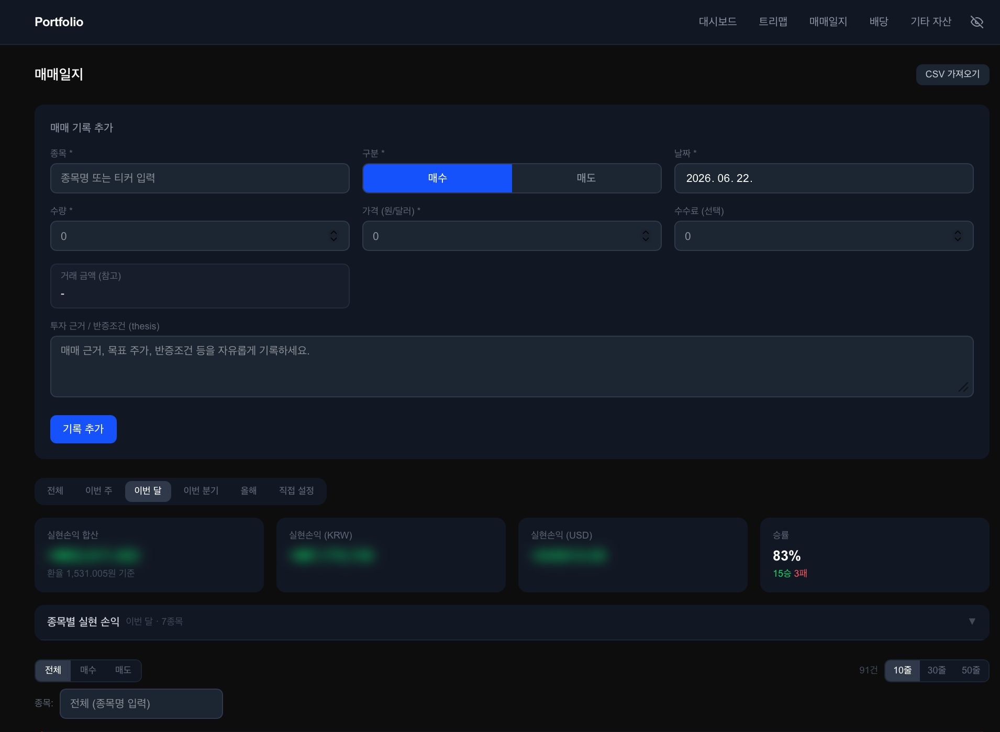
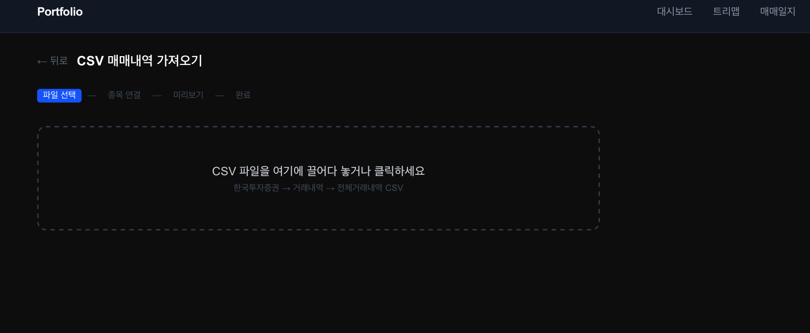
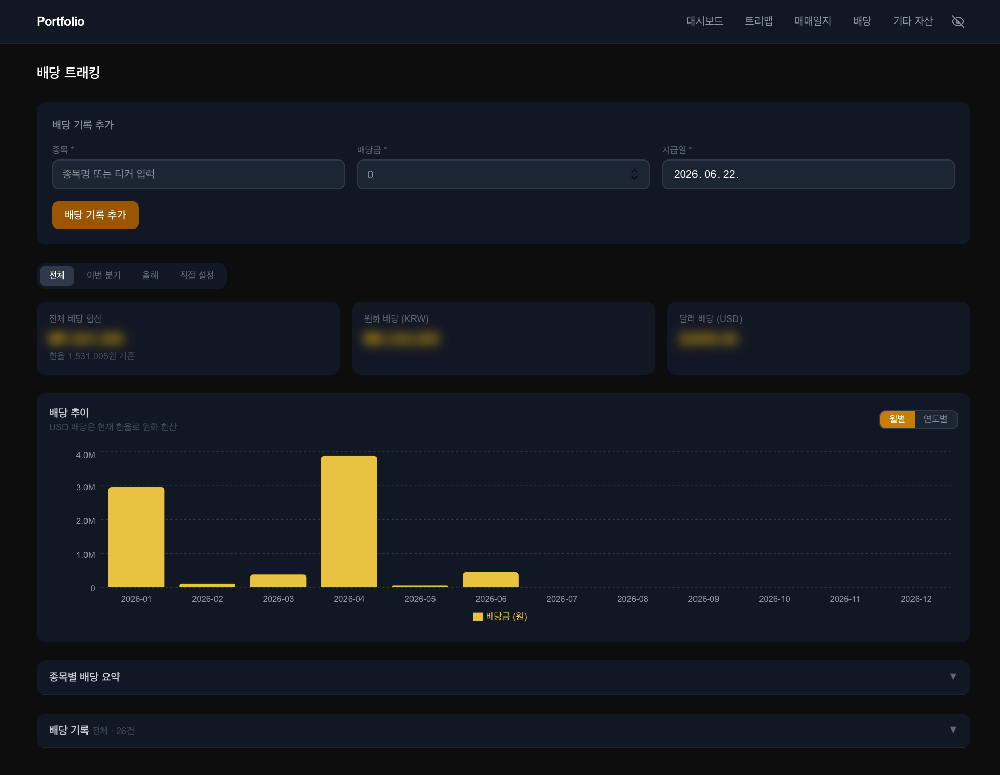
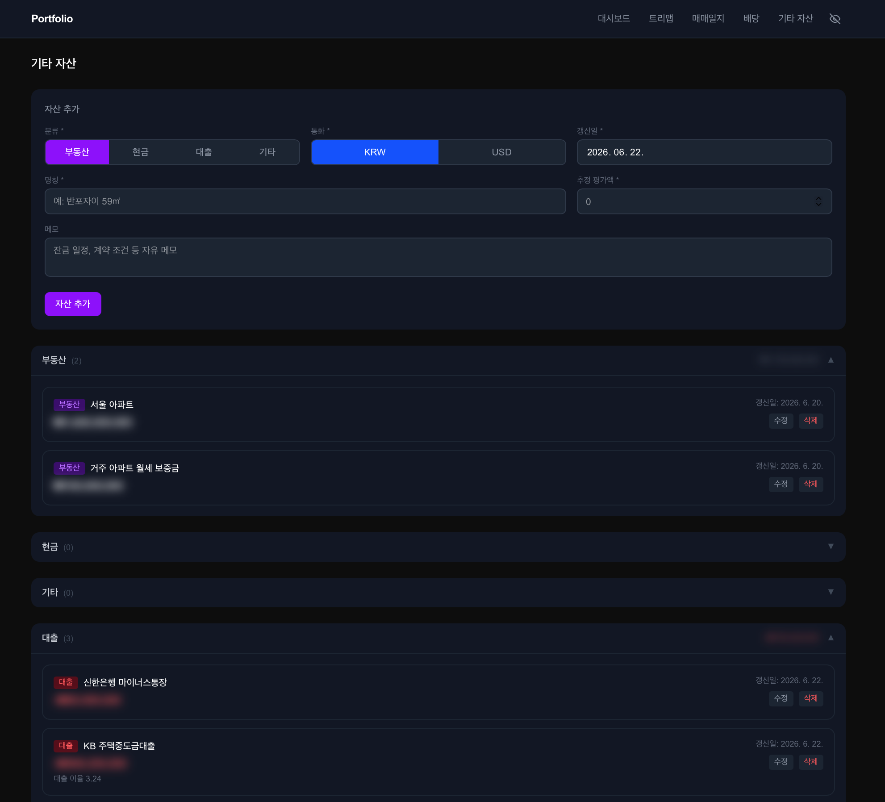

# 포트폴리오 대시보드

국내·해외 주식 포트폴리오를 한 곳에서 관리하는 셀프 호스팅 웹 앱입니다.  
한국투자증권 Open API로 현재가를 실시간 조회하고, 매매일지·배당·기타 자산을 통합 관리합니다.

---

## 화면 구성

### 대시보드

순자산 요약, 주식 평가금액·수익률·일간 손익을 한눈에 확인합니다.  
계좌가 여러 개인 종목은 아코디언으로 펼쳐서 계좌별 내역을 볼 수 있고, 전체·시장별·계좌별 뷰로 전환할 수 있습니다.


---

### 트리맵

보유 비중을 섹터별 2단계 트리맵으로 시각화합니다.  
평가금액·비중·수익률 중 원하는 기준으로 색상을 바꿀 수 있고, 카드형 뷰로도 전환할 수 있습니다.


---

### 매매일지

매수/매도 기록을 입력하고 실현손익을 계산합니다.  
이동평균법을 적용하며, 동일일 매수·매도가 있을 경우 증권사 정산 방식(매수 먼저 반영)을 따릅니다.

**주요 기능**
- 기간 필터 — 전체 · 이번 주 · 이번 달 · 이번 분기 · 올해 · 직접 설정
- KRW + USD 실현손익 합산 (원화 환산)
- 수수료 입력 및 손익 자동 차감
- 승률, 평균 수익률, 종목별 손익 요약
- KIS CSV 가져오기 — KIS 매매내역 CSV를 3단계 wizard로 일괄 등록 (현재는 한국투자증권만 제공)




---

### 배당

배당 수령 내역을 기록하고 수익률을 분석합니다.  
현재 보유하지 않는 종목에도 배당을 입력할 수 있습니다.

**주요 기능**
- 기간 필터 — 전체 · 이번 분기 · 올해 · 직접 설정
- KRW / USD 통화 분리 합산 카드
- 월별·연도별 배당 추이 차트 (데이터 없는 달도 0으로 표시)
- 종목별 누적배당 요약 — Yield on Cost, 시가배당률 포함
- 누적배당 기준 정렬 (USD는 실시간 환율로 원화 환산 비교)



---

### 기타 자산

주식 외 자산(부동산, 현금, 대출, 기타)을 등록해 순자산 합산에 반영합니다.




---

## 부가 기능

| 기능 | 설명 |
|------|------|
| **프라이버시 모드** | 네비게이션 토글로 모든 금액 블러 처리. 설정이 localStorage에 유지됨 |
| **ghost holding** | 전량 매도된 종목도 매매일지 이력 보존. 대시보드·트리맵에서는 자동 제외 |
| **계좌 관리** | 증권사·계좌명 등록 후 종목에 연결. 계좌별 집계 |
| **섹터 태그** | 종목에 자유 텍스트 섹터 태그 부여. 트리맵에서 섹터별 그룹화 |
| **해외주식 거래소 자동 탐지** | NAS / NYS / AMS 순서로 시도 후 성공한 거래소 코드를 DB에 캐싱 |
| **환율 자동 조회** | KIS FX API로 USD/KRW 실시간 환율 조회 및 원화 환산 |

---

## 기술 스택

| 분류 | 사용 기술 |
|------|----------|
| Framework | Next.js 16 (App Router) · React 19 · TypeScript |
| Database | SQLite + Prisma 7 |
| 시세 API | 한국투자증권 Open API |
| 차트 | D3.js (트리맵) · Recharts (배당 차트) |
| Styling | Tailwind CSS v4 |

---

## 시작하기

### 사전 요구사항

- Node.js 18 이상
- 한국투자증권 Open API 앱키·앱시크릿  
  ([apiportal.koreainvestment.com](https://apiportal.koreainvestment.com) 에서 신청)

### 설치

```bash
git clone https://github.com/<your-username>/portfolio-dashboard.git
cd portfolio-dashboard
npm install
```

### 환경변수 설정

```bash
cp .env.example .env
```

`.env` 파일을 열어 KIS API 키를 입력합니다.

```env
KIS_APP_KEY=your_app_key_here
KIS_APP_SECRET=your_app_secret_here
KIS_ENV=real              # real(실전) | vts(모의투자)
DATABASE_URL="file:./dev.db"

# 배포 시에만 필요 (로컬 개발은 불필요)
# NEXT_PUBLIC_BASE_URL=https://your-domain.com
```

### DB 초기화

```bash
npx prisma db push
npx prisma generate
```

### 실행

```bash
# 개발 모드 (코드 수정 시 즉시 반영)
npm run dev

# 프로덕션 모드 (실제 사용 시 권장)
npm run build
npm start
```

브라우저에서 [http://localhost:3000](http://localhost:3000) 접속.

### 업데이트 후 재실행

```bash
npm run build && npm start
```

---

## 프로젝트 구조

```
app/
├── page.tsx              # 대시보드
├── treemap/              # 트리맵
├── journal/              # 매매일지
│   └── import/           # KIS CSV 가져오기
├── dividends/            # 배당
├── assets/               # 기타 자산
├── rebalance/            # 리밸런싱
└── api/
    ├── holdings/         # 종목 CRUD + find-or-create
    ├── trades/           # 매매 기록 CRUD + import
    ├── dividends/        # 배당 CRUD
    ├── assets/           # 기타 자산 CRUD
    ├── accounts/         # 계좌 CRUD
    ├── search/           # Naver 종목 검색
    └── kis/              # KIS 현재가·환율 프록시

components/
├── DashboardTable.tsx    # 종목 테이블 (계좌별 그룹·아코디언)
├── HoldingForm.tsx       # 종목 추가/수정 폼
├── JournalStockPicker.tsx # 매매일지·배당 종목 선택기
├── Treemap.tsx           # D3 섹터 트리맵
├── RebalanceTable.tsx    # 리밸런싱 테이블
├── DividendChart.tsx     # 배당 추이 차트
├── NetWorthSummary.tsx   # 순자산 요약
└── PrivacyToggle.tsx     # 프라이버시 토글
```

---

## 데이터 보안

`.env` 와 `*.db` 파일은 `.gitignore`에 포함되어 있습니다.  
개인 자산 데이터는 로컬 SQLite(`dev.db`)에만 저장되며 외부로 전송되지 않습니다.

---

## 라이선스

MIT
